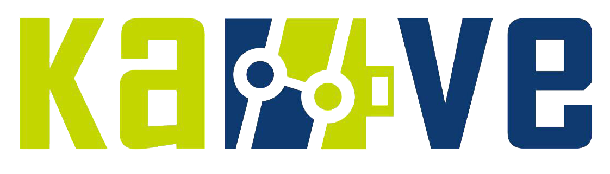

# KaVe-Ders-Dokumanlari

* Bu repositoryde Ka|Ve yapay zeka derslerimiz kapsamında kullanılan ders materyallerinin linkleri paylaşılacaktır. 
*

| Tarih  | Konu | Anlatıcı | Dokuman Linki |
| -----:|-----:|-----:|-----:|
| 02.04.2021   | CNN and Denoising Autoencoder with Pytorch |  Akif Emre Çapoğlu  | [Github](https://github.com/capogluuu/Denoising-Autoencoders-with-Pytorch)|

* KAYITLI DERS LİNKLERİ
* 

| Tarih  | Konu | Dokuman Linki |
| -----:|-----:|-----:|
| 25 Mart 2021   | 25 Mart 2021 Derin Öğrenme Odaklı Yapay Zeka Dersi | [Youtube](https://www.youtube.com/watch?v=_ZguXm-xQCI)|
| 18 Mart 2021   | 18 Mart 2021 Derin Öğrenme Odaklı Yapay Zeka Dersi | [Youtube](https://www.youtube.com/watch?v=hDUgnzUsO7A)|
| 11 Mart 2021   | 11 Mart 2021 Derin Öğrenme Odaklı Yapay Zeka Dersi | [Youtube](https://www.youtube.com/watch?v=hKV4iwH7-4o)|
| 4 Mart 2021   | 4 Mart 2021 Derin Öğrenme Odaklı Yapay Zeka Dersi | [Youtube](https://www.youtube.com/watch?v=eELmtE7zIig)|
| 25 Şubat 2021   | 25 Şubat 2021 Derin Öğrenme Odaklı Yapay Zeka Dersi | [Youtube](https://www.youtube.com/watch?v=1I5TWlfRb1A)|
| 18 Şubat 2021   | 18 Şubat 2021 Derin Öğrenme Odaklı Yapay Zeka Dersi | [Youtube](https://www.youtube.com/watch?v=u2RIGWupqNY)|
